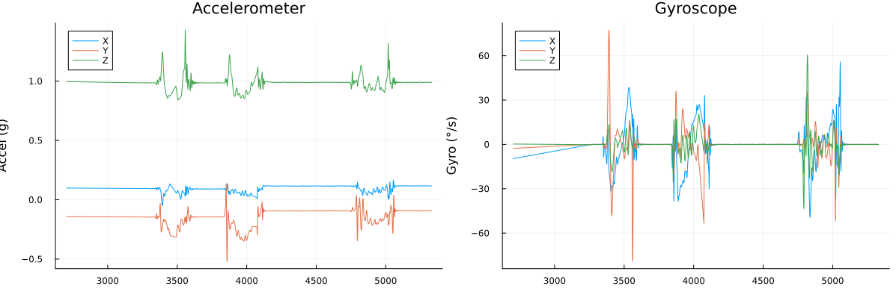

+++

date = 2026-01-22T15:10:00+02:00
title = 'Getting IMU data from a Stereo Camera'
description = 'Accessing IMU data on the Mynt Eye S2110 Stereo Camera using libuvc'
icon = 'file'
draft = false

+++

This specific stereo camera landed at the [TAMI](https://telavivmakers.org) hackerspace some years ago, its manufacturer Slightech seems to have seized operations entirely early in 2023.

The camera presents itself as a UVC(USB Video Class) Device. Which does have a standartized set of api's for the common webcam usecases like getting an image feed or adjusting parameters like gain,iso and white balance.

Thus getting the side by side stereo image from it is fairly straightfoward.


However getting non-standard data like its onboard IMU (Inertial Measurement Unit) and temperature sensors is a different story altogether, while the official SDK is open source, [(Github Repo)](https://github.com/slightech/MYNT-EYE-S-SDK/tree/master)
How it functions is "hidden" behing layers of abstraction and spaghetti code that grew with support requirements for a increasing range of hardware and firmware revisions.

So I ended up spending a morning sitting with a wireshark usb packet capture and the source code side by side, Understood how it works and wrote a simple snippet of code to get data from the sensors.

A major help was [libuvc](https://github.com/libuvc/libuvc), a crossplarform library for interacting with UVC devices.

>Note: The device itself must already be streaming images, for you to get IMU and temperature data.

The IMU sits on the `0x03` UVC Extension Unit(XU), to fetch data from it we have to first set its 0x03 Control number

```cpp
bool correspondence_on = true;

std::uint8_t imu_packet_set_data[5] = {0x5A, correspondence_on, 0x00, 0x00, 0x00};

res_int = uvc_set_ctrl(devh, 0x03, 0x03, imu_packet_set_data, sizeof(imu_packet_set_data));
```

Documentation claims that the correspondence value is for syncronizing the clock between the image stream and IMU.

In practice with correspondence set to `false` you will just get the gyro and accel data packets separately from each other.

Running this `uvc_set_ctrl` operation must be done every time before we fetch the sensor data, otherwise it wont be filled and you will get empty data frames in response.

Now to actually fetch the data we have to send a `get` to the 0x04 Control number of the same XU.

```cpp
static std::uint8_t data[2000]{};
res_int = uvc_get_ctrl(devh, 0x03, 0x04, data, sizeof(data), UVC_GET_CUR);
```

The data buffer size is always preset to 2000 throughout the official SDK and packet captures.

Now we get to decoding the data, I took this code directly from the official SDK.

Here's our data structs

```cpp
struct ImuSegment {
  std::uint32_t frame_id;
  std::uint64_t timestamp;
  std::uint8_t flag; // 1=accel, 2=gyro, 3=both
  
  bool is_ets; // Is external time source
  float temperature;
  float accel[3];
  float gyro[3];
};

struct ImuPacket {
  std::uint8_t version;
  std::uint8_t count;
  std::uint32_t serial_number;
  std::vector<ImuSegment> segments;
};

struct ImuResPacket {
  std::uint8_t version;
  std::uint8_t header;
  std::uint8_t state;
  std::uint16_t size;
  std::vector<ImuPacket> packets;
  std::uint8_t checksum;
};

#define BYTE_4(data, begin) (*(data + begin) << 24) | \
                    (*(data + begin + 1) << 16) | \
                    (*(data + begin + 2) << 8) | \
                    *(data + begin + 3)

struct ImuData {
  std::uint32_t frame_id;
  std::uint64_t timestamp;
  std::uint8_t flag;
  float temperature;
  float accel_or_gyro[3];
  float gyro_add[3];

  ImuData() = default;
  explicit ImuData(const std::uint8_t *data) {
    from_data(data);
  }

  void from_data(const std::uint8_t *data) {
    std::uint32_t timestamp_l;
    std::uint32_t timestamp_h;
    frame_id = BYTE_4(data, 0);
    timestamp_h = (*(data + 4) << 24) | (*(data + 5) << 16) |
                  (*(data + 6) << 8) | *(data + 7);
    timestamp_l = (*(data + 8) << 24) | (*(data + 9) << 16) |
                  (*(data + 10) << 8) | *(data + 11);
    timestamp = (static_cast<std::uint64_t>(timestamp_h) << 32) | timestamp_l;
    flag = *(data + 12); 
    temperature = *((float*)(data+ 13));
    accel_or_gyro[0] = *((float*)(data + 17));
    accel_or_gyro[1] = *((float*)(data + 21));
    accel_or_gyro[2] = *((float*)(data + 25));
    if (flag == 3) {
      gyro_add[0] = *((float*)(data + 29));
      gyro_add[1] = *((float*)(data + 33));
      gyro_add[2] = *((float*)(data + 37));
    }
  }
};
```

Additional helper functions for decoding the data

```cpp
void unpack_imu_segment(const ImuData &imu, ImuSegment *seg) {
    seg->frame_id = imu.frame_id;
    seg->timestamp = imu.timestamp;
    seg->flag = imu.flag & 0b0011;
    seg->is_ets = ((imu.flag & 0b0100) == 0b0100);
    seg->temperature = imu.temperature;
    if (seg->flag == 1) {
        seg->accel[0] = imu.accel_or_gyro[0];
        seg->accel[1] = imu.accel_or_gyro[1];
        seg->accel[2] = imu.accel_or_gyro[2];
        seg->gyro[0] = 0.;
        seg->gyro[1] = 0.;
        seg->gyro[2] = 0.;
    } else if (seg->flag == 2) {
        seg->gyro[0] = imu.accel_or_gyro[0];
        seg->gyro[1] = imu.accel_or_gyro[1];
        seg->gyro[2] = imu.accel_or_gyro[2];
        seg->accel[0] = 0.;
        seg->accel[1] = 0.;
        seg->accel[2] = 0.;
    } else if (seg->flag == 3) {
        seg->gyro[0] = imu.accel_or_gyro[0];
        seg->gyro[1] = imu.accel_or_gyro[1];
        seg->gyro[2] = imu.accel_or_gyro[2];
        seg->accel[0] = imu.gyro_add[0];
        seg->accel[1] = imu.gyro_add[1];
        seg->accel[2] = imu.gyro_add[2];
    }
}

void unpack_imu_packet(const std::uint8_t *data, ImuPacket *pkg, bool is_correspondence_on) {
  std::size_t data_n = 29;
  if (is_correspondence_on) {
    data_n = 41;
  }

  for (std::size_t i = 0; i < pkg->count; i++) {
    ImuSegment seg;
    unpack_imu_segment(ImuData(data + data_n * i), &seg);
    pkg->segments.push_back(seg);
  }
  if (pkg->count) {
    pkg->serial_number = pkg->segments.back().frame_id;
  } else {
    printf("The imu data pipeline lost more than 5 samples continuously, please check the device and firmware");
  }
}

void unpack_imu_res_packet(const std::uint8_t *data, ImuResPacket *res, bool is_correspondence_on) {
  res->header = *data;
  res->state = *(data + 1);
  res->size = (*(data + 2) << 8) | *(data + 3);

  std::size_t data_n = 29;
  if (is_correspondence_on) {
    data_n = 41;
  }

  ImuPacket packet;
  packet.count = res->size / data_n;
  unpack_imu_packet(data + 4, &packet, is_correspondence_on);
  res->packets.push_back(packet);

  res->checksum = *(data + 4 + res->size);
}
```

And the loop for reference sake

```cpp
bool correspondence_on = true;

while(true){
    int res_int;

    std::uint8_t imu_packet_set_data[5] = {0x5A, correspondence_on, 0x00, 0x00, 0x00};

    res_int = uvc_set_ctrl(devh, 0x03, 0x03, imu_packet_set_data, sizeof(imu_packet_set_data));

    if (res_int <0) {
    uvc_perror(static_cast<uvc_error_t>(res_int), " ... uvc_set_ctrl failed to set imu packet thing");
    } else {
    //printf(" ... set imu packet thing length: %d\n", res_int);
    }

    static std::uint8_t data[2000]{};
    static ImuResPacket imu_res_packet;
    res_int = uvc_get_ctrl(devh, 0x03, 0x04, data, sizeof(data), UVC_GET_CUR);

    if (res_int < 0) {
    uvc_perror(static_cast<uvc_error_t>(res_int), " ... uvc_get_ctrl failed to get imu data");
    } else {

    unpack_imu_res_packet(data, &imu_res_packet, correspondence_on);

    for (const auto &pkg : imu_res_packet.packets) {
        for (const auto &seg : pkg.segments) {
        printf("id: %u, time: %llu, flag: %u, ets: %d, temp: %.2f, "
                "accel: [%.4f, %.4f, %.4f], gyro: [%.4f, %.4f, %.4f]\n",
                seg.frame_id, seg.timestamp, seg.flag, seg.is_ets,
                seg.temperature,
                seg.accel[0], seg.accel[1], seg.accel[2],
                seg.gyro[0], seg.gyro[1], seg.gyro[2]);
        }
    }
    }
}
```

Lastly, the console output will look like this.

```log
id: 13526, time: 841902864, flag: 3, ets: 0, temp: 31.38, accel: [-0.1558, 0.1452, 0.5871], gyro: [-31.7743, 121.3277, -44.7921]
id: 13527, time: 841907844, flag: 3, ets: 0, temp: 31.38, accel: [-0.2257, 0.1427, 0.8423], gyro: [-37.4513, 163.7268, -47.7258]
id: 13528, time: 841912844, flag: 3, ets: 0, temp: 31.38, accel: [-0.2868, 0.1226, 1.1108], gyro: [-41.4816, 196.6354, -48.2747]
id: 13529, time: 841917824, flag: 3, ets: 0, temp: 31.38, accel: [-0.3327, 0.0925, 1.3659], gyro: [-43.8228, 218.4106, -47.4986]
id: 13530, time: 841922824, flag: 3, ets: 0, temp: 31.38, accel: [-0.3631, 0.0629, 1.5914], gyro: [-41.6373, 228.2444, -45.6293]
id: 13531, time: 841927804, flag: 3, ets: 0, temp: 31.38, accel: [-0.3791, 0.0452, 1.7757], gyro: [-30.7829, 225.6032, -42.1217]
id: 13532, time: 841932804, flag: 3, ets: 0, temp: 31.38, accel: [-0.3803, 0.0421, 1.9176], gyro: [-9.2245, 209.7359, -36.1353]
id: 13533, time: 841937784, flag: 3, ets: 0, temp: 31.38, accel: [-0.3626, 0.0474, 2.0133], gyro: [19.0790, 180.0361, -27.6391]
id: 13534, time: 841942784, flag: 3, ets: 0, temp: 31.38, accel: [-0.3183, 0.0519, 2.0577], gyro: [45.6226, 136.8600, -17.4213]
```


