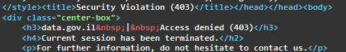

+++

date = 2024-12-14T13:00:00+02:00
title = 'Creating an Update Feed for Open Government Data'
description = "A system to track changes to datasets on Israel's open data portal, posting the updates to a Telegram channel"
icon = 'file'
draft = false

+++

The Israeli government congregates the publicly released open data from across its government branches/ministries on the [data.gov.il](https://data.gov.il/) portal

I wanted to make a feed that tracks changes and updates to these datasets

### Metadata

First, we need to figure out what datasets are available

Luckily, the official frontend had the datasets sorted by last update

This means I can save a lot of time by only needing to look for changes in the latest datasets


So I went on to dig for the API, and found a OpenAPI spec file. <https://data.gov.il/api/docs#/>

However, it seems like most of the endpoints available were getting blocked by the firewall



> As of me writing this they have added official API examples on the main page

From the API docs I could see the underlying data was stored in a [CKAN](https://ckan.org) instance, which is a common open data platform

Looking at the network calls from the frontend, it seems like the API is only directly called when previewing individual datasets, while the list I wanted was server-side rendered static html

Ended up finding a POST package_search endpoint which had package data sorted by last_update

While the documentation claims the number of rows I could query is clamped to 1000


However, if I set the rows to a larger number it still successfully returns all the packages


> I dont think this is a ddos concern considering the processing latency for this request was very small.
>
> While the response json is quite big at 8.5 Megabytes its also easily cacheable as it changes at most every 15 minutes

This API endpoint gives us a json list of all the data packages and resources on the [data.gov.il](https://data.gov.il/) platform

**Packages/Datasets** Being the logical grouping of data, for example *[Public Transit Fare Statistics](https://data.gov.il/dataset/tikufim-2021)*

```golang
type Package struct {
	Frequency              string       `json:"frequency"`
	Author                 string       `json:"author"`
	AuthorEmail            string       `json:"author_email"`
	CreatorUserId          string       `json:"creator_user_id"`
	Id                     string       `json:"id"`
	IsOpen                 bool         `json:"is_open"`
	LicenseId              string       `json:"license_id"`
	MetadataCreated        string       `json:"metadata_created"`
	MetadataModified       string       `json:"metadata_modified"`
	Name                   string       `json:"name"`
	Notes                  string       `json:"notes"`
	NumResources           int          `json:"num_resources"`
	NumTags                int          `json:"num_tags"`
	Organization           Organization `json:"organization"`
	Private                bool         `json:"private"`
	Remark                 string       `json:"remark"`
	Title                  string       `json:"title"`
	Type                   string       `json:"type"`
	Url                    string       `json:"url"`
	Version                string       `json:"version"`
	Resources              []Resource   `json:"resources"`
	Tags                   []Tag        `json:"tags"`
}
```

**Resources** Constitute the literal data files contained within Packages (.csv,.pdf,.xlsx file etc)


```golang
type Resource struct {
	Frequency                               string `json:"frequency"`
	Category                                string `json:"category"`
	CkanUrl                                 string `json:"ckan_url"`
	Format                                  string `json:"format"`
	Id                                      string `json:"id"`
	LastModified                            string `json:"last_modified"`
	MetadataModified                        string `json:"metadata_modified"`
	Mimetype                                string `json:"mimetype"`
	Name                                    string `json:"name"`
	Notes                                   string `json:"notes"`
	PackageId                               string `json:"package_id"`
	ResourceId                              string `json:"resource_id"`
	Size                                    int    `json:"size"`
	State                                   string `json:"state"`
	Url                                     string `json:"url"`
}
```

### Fetching data

Given I wanted to know about changes in the resources, I needed to store a copy of all the resources locally to compare and update first

Deciding to focus on just the CSV files at first, as those are quite trivial to parse, especially compared to pdf or xlsx

I wrote a script to iterate over the API response json, fetching the csv files then sorting them into directories in such order: `{organization_name}/{dataset_id}/{resource_id}.csv`

But all the files I would get were html files with an obfuscated javascript payload instead of valid csv files, this confused me a bit because I couldn't replicate the issue in the browser


Trying it with an API debugger client *(None of them are particularly good nor mention worthy)* I was able to get the same obfuscated javascript response

While trawling through the website, I found a section about crawling for data files which asked to have `datagov-external-client` in your user agent

> My guess this is to prevent automatic crawlers (search engine bots) from downloading hundreds of gigabytes of frequently changing files

After adding the string to my user agent, it started fetching the real files

The next problem was that occasionally during long downloads, the connection would get dropped by the firewall.

Implementing retry with jittered exponential backoff (To prevent crowding where multiple threads restart the download at the same time) let me finally fetch all the files

Then I saw how the data on disk quickly ballooned to 70+ GB with most of it being irrelevant, one time datasets that were uploaded once and will never be updated

Adding a limit to the prefetch so it would only download the last week of datasets cut it all the way down to 6 GB and scoped it to datasets which update frequently

### Diffing

Fetch the latest json API response containing all the metadata about the packages and resources

Get the latest metadata modification time from the previous json response already stored on disk

Check the metadata modification time of each resource against the previous one. Only fetching the packages which have been updated since

Because I only care about additions and edits and not deletions, the diffing workflow is quite simple

The diffing function loads the existing csv file on disk and hashes each line (therefore diffing by rows) and then while its downloading the new csv file it checks its rows against the hash set.

If the rows are also present in the existing file skip them, otherwise add them to a list of strings representing the file diff

### Publishing Diff

Now it's time to format the diff into a telegram message and send it to the [channel](https://t.me/DataSoup)

Telegram allows you to send messages in Markdown format, It also allows you to specify the raw text and the "entities" (which are specially formatted parts of the message) separately

I decided to go with that approach to prevent issues with the diff data interfering with the automatic formatting

When you specify entities separately, you have to provide their offset and length within the message text in utf-16 code units

Which is a bit of a pain considering when I construct the final message I add up adding newlines and spaces, and I therefore ended up with a handful of magic numbers that I have to keep track of when I change the formatting of the message

However, telegram still tries to parse the underlying raw text, so it sometimes ends up broken.


> Its wiser to sanitize the diff data and use a markdown or html template (which telegram also supports). Instead of faffing about with entities and offsets

Once I had the telegram messages successfully posting, I noticed that some of them have encoding issues


After investigating and comparing resources with and without encoding problems, I found the erroneous resources were encoded with the windows1255 encoding instead of UTF-8

But I wasn't able to find anything in the resource metadata that could suggest that a file is windows1255 encoded

While looking into encoding detection algorithms (Most of which are probabilistic) I realised this isn't a "core" issue that I would've wanted to solve by myself and I picked up an existing golang library for file encoding detection <https://github.com/saintfish/chardet>

If the library detects that a file is anything other than utf-8, I assume it's windows1255 and convert it

The reason for that is because sometimes the ratio of erroneous characters is so small it will detect a different iso encoding

Once the diff gets posted to telegram, the new data file we fetched overwrites the one on disk

After all files and changes are processed successfully, we override the old json metadata about the packages and resources with the new one we fetched at the start of the process

### What's next

You can go check out the github repo here <https://github.com/Wissotsky/DataSoup>

Or view the feed on telegram here <https://t.me/DataSoup>

The next step is towards visualizing the diffs better by processing the data before it gets posted on the telegram channel

|Before|After|
|---|---|
|||
